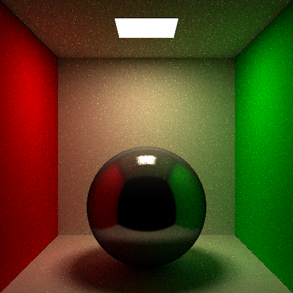
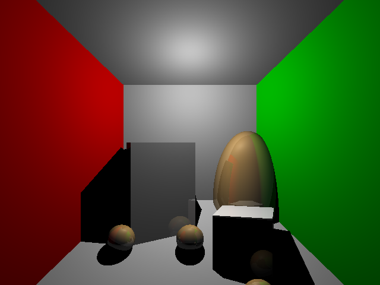
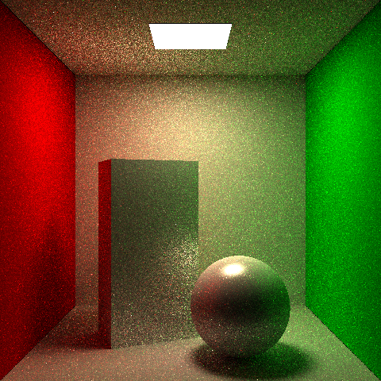
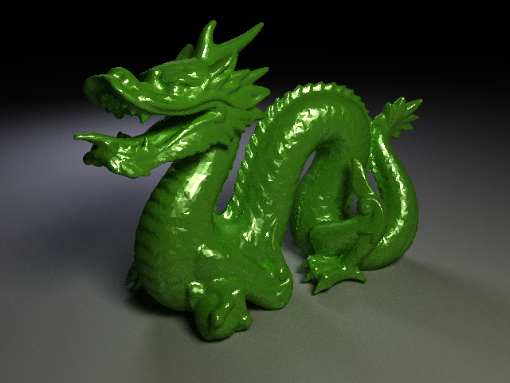

# C++ Path Tracer with Importance Sampling and MIS

A C++ rendering project developed through the **UC San Diego / UCSanDiegoX – Computer Graphics II: Rendering** MOOC and extended across four homework stages, from basic recursive ray tracing to a Monte Carlo path tracer with **Next Event Estimation (NEE)**, **Russian Roulette**, **importance sampling**, and **Multiple Importance Sampling (MIS)**.

This repository is kept close to the original Visual Studio project layout so that the existing build configuration, relative paths, and runtime asset loading remain intact.

## Highlights

<p align="center">
  
</p>

- Built a C++ offline renderer from scratch as a progressive rendering project
- Implemented recursive ray tracing foundations and scene intersection logic
- Added **uniform-grid acceleration** for faster ray traversal in more complex scenes
- Extended the renderer from direct lighting to **indirect path tracing**
- Implemented **Next Event Estimation (NEE)** for direct-light sampling during path tracing
- Added **Russian Roulette** to control path length and rendering cost
- Implemented **Cosine Sampling**, **BRDF Sampling**, and **MIS** as the final stage
- Produced step-by-step result images showing variance reduction and image quality improvement

## Project Context

This project was completed as part of the **2025-2 Blue Semester / MOOC** track based on the UC San Diego rendering course.  
According to the final report, the work progressed through:

1. **Homework 1** – recursive ray tracing, reflections, shadows  
2. **Homework 2** – Monte Carlo direct lighting and soft shadows  
3. **Homework 3** – indirect path tracing, color bleeding, NEE, Russian Roulette  
4. **Homework 4** – importance sampling and **MIS** for variance reduction

The final focus of this repository is the **Homework 4 stage**, where the renderer was extended with multiple sampling strategies and MIS.

## Core Rendering Features

### 1. Ray tracing and scene handling
The renderer supports basic scene loading, geometry intersection, camera/view setup, and object transforms as the foundation of the rendering pipeline.

### 2. Uniform-grid acceleration
The path tracer includes grid-cell traversal logic for accelerated intersection testing rather than relying only on brute-force object iteration.

### 3. Direct lighting and path tracing
The renderer supports both direct illumination and indirect illumination. It was progressively extended from Whitted-style / direct-light-oriented rendering toward a Monte Carlo path tracer.

### 4. Next Event Estimation (NEE)
The path tracing path includes explicit light sampling for quad lights, using geometric terms and BRDF evaluation to reduce variance in direct-light estimation.

### 5. Russian Roulette
The path tracer optionally uses Russian Roulette to terminate low-contribution paths and keep computation practical while preserving unbiasedness.

### 6. Importance sampling
The project implements multiple sampling strategies:
- **Cosine-weighted hemisphere sampling**
- **BRDF-based sampling**
- **Phong / GGX-related BRDF sampling paths**
- **MIS (Multiple Importance Sampling)** to combine BRDF sampling and NEE

## Code Notes

The largest amount of rendering logic is concentrated in:

- `hw2-windows/main.cpp` — integrator logic, sampling logic, direct/indirect lighting flow, NEE, MIS, and path tracing behavior
- `hw2-windows/Geometry.*` — geometry and intersection handling
- `hw2-windows/Scene.*` — scene data and rendering configuration
- `hw2-windows/readfile.*` — scene parsing / loading
- `hw2-windows/shaders/` — OpenGL display-side shader files for visualization / output support
- `hw2-windows/*.test` — test scenes used during the MOOC assignments

## Repository Structure

```text
cpp_path_tracer/
├─ Docs/                  # result images and documentation assets
├─ hw2-windows/           # original Visual Studio project directory
│  ├─ include/
│  ├─ lib/
│  ├─ shaders/
│  ├─ UCSD/
│  ├─ main.cpp
│  ├─ Geometry.cpp / .h
│  ├─ Scene.cpp / .h
│  ├─ Transform.cpp / .h
│  ├─ readfile.cpp / .h
│  ├─ display.cpp
│  ├─ shaders.cpp / .h
│  ├─ types.cpp / .h
│  ├─ variables.h
│  ├─ *.test
│  └─ teapot.obj
├─ packages/
├─ hw4.sln
└─ .gitignore
```

## Why the folder name is still `hw2-windows`

The original project directory name was intentionally kept unchanged to preserve:
- Visual Studio project settings
- relative file paths
- runtime asset loading behavior used throughout the homework stages

Although the repository highlight is the final **Homework 4** renderer, the underlying project structure evolved incrementally from earlier homework stages.

## Results

The `Docs/` folder contains representative images from different stages of the project, including:

- `cornellCosine.png`
- `cornellBRDF.png`
- `cornellMIS.png`
- `cornellNEE.png`
- `cornellRR.png`
- `dragon.png`
<p align="center">
  
  
  
</p>
<p align="center">
  
</p>

These images show the progression from simpler sampling strategies toward the final MIS-based renderer with visibly reduced variance.

## Build / Run

This repository is currently organized around the original **Visual Studio solution**.

### Recommended environment
- Windows
- Visual Studio
- OpenGL toolchain used by the original project configuration

### Basic steps
1. Open `hw4.sln`
2. Build the solution in Visual Studio
3. Run the configured project
4. Use the included `.test` scene files and assets under `hw2-windows/`

Because this repository preserves the original course-project layout, keeping the folder structure unchanged is recommended.

## What this project demonstrates

For a graphics / rendering engineer role, this project demonstrates:
- solid C++ implementation experience
- understanding of light transport and Monte Carlo rendering
- ability to implement and compare different sampling strategies
- practical knowledge of variance reduction techniques such as **NEE**, **Russian Roulette**, and **MIS**
- experience turning rendering theory into working code and measurable visual results

---

## Contact

- GitHub: https://github.com/whlee503
- Email: whlee503@ajou.ac.kr
